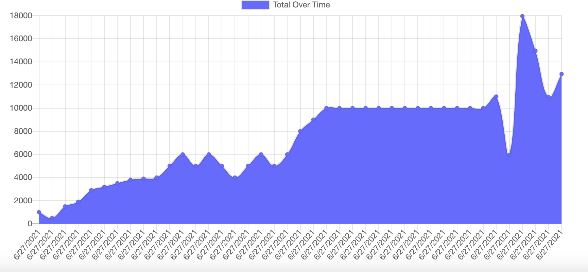
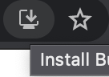

# Budget Tracker 
## Description 
Budget Tracker is an easy to use manager for your everyday expenses. It allows you to store information about your transactions whether connected to the internet or not. 
## Deployed app
Deployed with heroku. 
https://stormy-tundra-78046.herokuapp.com/  
## Table of Contents 
* [Layout](#layout) 
* [Offline](#offline) 
* [Technology](#technology) 
* [Questions](#questions) 
## Layout 
At the top of the page, there are fields to describe your transaction through a name, amount, and whether it is an addition or subtraction. These transactions are then input into a table below. 

Example Table 
 

These transactions are also represented in a graph to help you better understand your finances since your first input. 

Example Graph 
 

## Offline 
The app also works regardless of your internet connection. This app was designed to be on the go so users on their mobile devices do not have to worry about losing their information due to internet. All expenses you input when in offline mode will automatically be updated when you restore internet connection. 

There is also a feature to install the app on your device to use entirely offline if you do not wish to use the website version of the app. 

Installation Icon located in browser searchbar 
 

## Technology 
Javascript 
CSS 
HTML 
Heroku 
Express 
Mongoose 
MongoDB 
Morgan 
Compression 
NPM 

## Questions 
GitHub: https://github.com/adambedingfield 
Email: adamcbedingfield@gmail.com 
